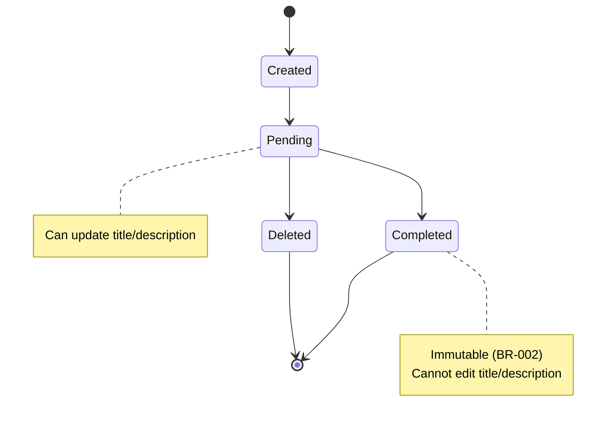

# Data Model: Console Todo System

**Phase**: 1 - Console Todo Foundation
**Date**: 2026-01-01
**Status**: Draft
**Based On**: [spec.md](./spec.md), [plan.md](./plan.md), [research.md](./research.md)

## Entity Definitions

### Todo Entity

**Purpose**: Core entity representing a task with immutable business rules

**Python Implementation**: `dataclass` with type hints and validation

**Attributes**:

| Field | Type | Constraint | Business Rule | Description |
|-------|------|-------------|----------------|-------------|
| id | `str` | Unique, never reused | BR-004, FR-001 | Deterministic identifier for todo |
| title | `str` | Required, non-empty | BR-001, FR-002 | Human-readable task name |
| description | `Optional[str]` | Optional | FR-003 | Additional task details (may be None) |
| status | `TodoStatus` | Enum: Pending | Completed | FR-004 | Current state of todo |
| created_timestamp | `datetime` | Auto-generated | FR-005 | When todo was created |
| updated_timestamp | `datetime` | Auto-generated | FR-006 | When todo was last modified |

**Python Implementation**:

```python
from dataclasses import dataclass, field
from datetime import datetime
from typing import Optional
from enum import Enum

class TodoStatus(Enum):
    """Todo status enum - mutually exclusive states"""
    PENDING = "Pending"
    COMPLETED = "Completed"

@dataclass
class Todo:
    """Core entity representing a task

    Business Rules (from spec BR-001 to BR-005):
    - BR-001: Title cannot be empty
    - BR-002: Completed todos cannot be edited
    - BR-003: Deleted todos are permanently removed
    - BR-004: IDs are never reused
    - BR-005: System behavior must be deterministic
    """

    id: str  # Unique, deterministic, never reused (BR-004)
    title: str  # Required, non-empty (BR-001, FR-002)
    description: Optional[str]  # Optional (FR-003)
    status: TodoStatus  # Enum: Pending | Completed (FR-004)
    created_timestamp: datetime  # Auto-generated (FR-005)
    updated_timestamp: datetime  # Auto-generated on modification (FR-006)

    def __post_init__(self):
        """Validate business rules after initialization"""
        # BR-001: Title cannot be empty
        if not self.title or not self.title.strip():
            raise ValueError("Title cannot be empty")

        # FR-004: Status must be valid enum value
        if not isinstance(self.status, TodoStatus):
            raise ValueError(f"Invalid status: {self.status}")

        # FR-005: created_timestamp must be set
        if not self.created_timestamp:
            raise ValueError("created_timestamp is required")

        # FR-006: updated_timestamp must be set
        if not self.updated_timestamp:
            raise ValueError("updated_timestamp is required")

    def can_edit(self) -> bool:
        """Check if todo can be edited (BR-002)"""
        return self.status == TodoStatus.PENDING

    def is_completed(self) -> bool:
        """Check if todo is completed"""
        return self.status == TodoStatus.COMPLETED
```

**State Transitions**:



**Business Rule Enforcement**:

| Rule | Enforcement Point | Validation |
|------|------------------|------------|
| BR-001 | Todo.__post_init__ | Title non-empty validation |
| BR-002 | TodoService.update() | Reject edit if status == Completed |
| BR-003 | TodoRepository.delete() | Permanently remove (no soft delete) |
| BR-004 | IDGenerator.next_id() | Monotonic increment, never reuse |
| BR-005 | All operations | No randomness, no hidden state |

**Lifecycle**:

```
Created (id, title, desc, Pending, timestamps)
    ↓ (while Pending)
    Updates (title/description) → updated_timestamp
    ↓
    Mark as Completed → status = Completed, updated_timestamp
    ↓
    Immutable (cannot edit title/description per BR-002)
    ↓
    Delete (permanently removed per BR-003)
```

## Relationships

### Todo → None

Todo entity is standalone in Phase 1. Future phases may introduce:
- Phase II: Todo → User (ownership)
- Phase II: Todo → Category/Tag (classification)
- Phase III: Todo → AIConversation (chatbot context)

## Constraints

### Immutability Rules

1. **BR-002**: Once `status == COMPLETED`, `title` and `description` are immutable
   - Violation: Attempting to update completed todo
   - Response: `ValueError("Cannot edit completed todos")`

2. **BR-004**: IDs are never reused
   - Violation: Attempting to assign used ID
   - Response: `ValueError("ID already exists")

3. **BR-005**: System must be deterministic
   - Violation: Randomness in ID generation or timestamp handling
   - Response: Forbidden by architecture

### Validation Rules

1. **Title Validation**: Must be non-empty string
2. **Description Validation**: Optional string (None or non-empty)
3. **Status Validation**: Must be `TodoStatus.PENDING` or `TodoStatus.COMPLETED`
4. **Timestamp Validation**: Must be `datetime` object (not string)

## Extension Points for Future Phases

### Phase II: Web UI + Persistence

```python
@dataclass
class Todo:
    # ... existing fields ...

    # Extension fields (Phase II)
    owner_id: Optional[str] = None  # User ownership
    category_id: Optional[str] = None  # Category classification
    tags: list[str] = field(default_factory=list)  # Tag support
```

### Phase III: AI Chatbot

```python
@dataclass
class Todo:
    # ... existing fields ...

    # Extension fields (Phase III)
    ai_suggested: bool = False  # Was suggested by AI?
    ai_confidence: float = 0.0  # AI suggestion confidence
    conversation_id: Optional[str] = None  # Linked chat context
```

## Testing Considerations

### Unit Tests Required

1. **Todo Entity Tests** (`tests/unit/models/test_todo.py`):
   - Test initialization with valid data
   - Test validation: empty title raises ValueError
   - Test validation: invalid status raises ValueError
   - Test can_edit() returns True for Pending
   - Test can_edit() returns False for Completed
   - Test is_completed() returns correct status

2. **Determinism Tests**:
   - Same input produces same Todo object (BR-005)
   - Timestamps are deterministic (not random)

3. **Immutability Tests**:
   - Completed todo cannot be updated (BR-002)

## Notes

- Todo entity is foundation for all future phases
- Business rules (BR-001 to BR-005) must never be violated
- Dataclass provides clean, type-safe implementation
- Immutable rules enforced in Application layer (TodoService), not entity
- Extension fields added in future phases without modifying core fields (Phase Locking Rule)
