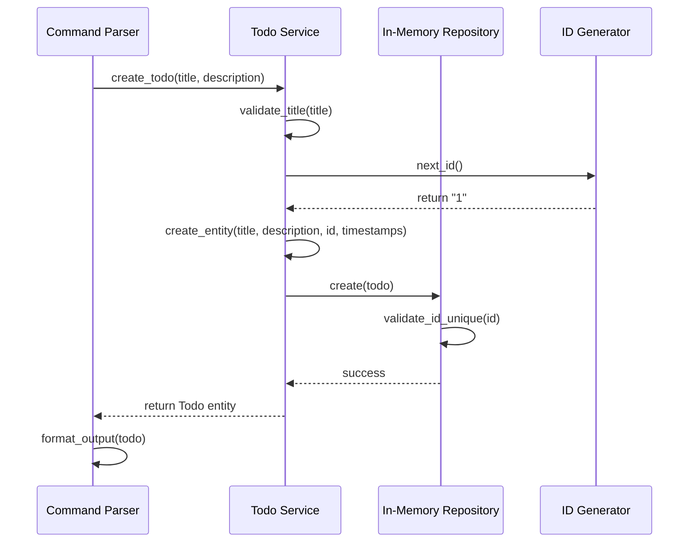

# Quickstart Guide: Console Todo System

**Phase**: 1 - Console Todo Foundation
**Date**: 2026-01-01
**Status**: Draft
**Based On**: [plan.md](./plan.md), [data-model.md](./data-model.md), [contracts/service-contracts.md](./contracts/service-contracts.md)

## Prerequisites

### System Requirements

- Python 3.11+ installed and available as `python3` or `python`
- Git for version control
- Terminal/console with UTF-8 support

### Python Environment

```bash
# Check Python version
python --version  # Should show Python 3.11 or higher

# Create virtual environment (recommended)
python -m venv .venv

# Activate virtual environment
# Windows:
.venv\Scripts\activate
# Linux/macOS:
source .venv/bin/activate
```

### Development Dependencies

```bash
# Install development dependencies
pip install pytest pytest-cov coverage

# Verify installation
pytest --version      # Should show pytest 7.x
coverage --version   # Should show coverage 7.x
```

**Note**: No runtime dependencies required (AC-004 - zero external libraries).

---

## Project Structure

```
src/
├── presentation/cli/
│   ├── command_parser.py    # CLI command parsing (argparse)
│   └── output_formatter.py  # Console output formatting
├── application/
│   ├── services/
│   │   ├── todo_service.py   # Business logic and validation
│   │   └── id_generator.py   # Deterministic ID generation
│   └── models/
│       └── todo.py           # Todo entity definition
└── infrastructure/
    └── repositories/
        └── in_memory_todo_repository.py  # In-memory storage

tests/
├── unit/
│   ├── models/
│   │   └── test_todo.py
│   ├── services/
│   │   ├── test_todo_service.py
│   │   └── test_id_generator.py
│   └── repositories/
│       └── test_in_memory_todo_repository.py
└── integration/
    └── test_cli_workflows.py

main.py                   # CLI entry point
pytest.ini                # pytest configuration
requirements-dev.txt        # Development dependencies
```

---

## Quickstart: 5-Minute Tutorial

### Step 1: Create Your First Todo

```bash
# Run the application
python main.py create "Buy groceries" --description "Milk, eggs, bread"
```

**Expected Output**:
```
✓ Todo created successfully
[1] Buy groceries
    Description: Milk, eggs, bread
    Status: Pending
    Created: 2026-01-01 10:00:00
```

### Step 2: List All Todos

```bash
# List all todos
python main.py list
```

**Expected Output**:
```
○ [1] Buy groceries
    Description: Milk, eggs, bread
    Status: Pending
    Created: 2026-01-01 10:00:00
```

### Step 3: Complete a Todo

```bash
# Mark todo as completed
python main.py complete 1
```

**Expected Output**:
```
✓ Todo completed successfully
[1] Buy groceries
    Description: Milk, eggs, bread
    Status: Completed
    Created: 2026-01-01 10:00:00
    Updated: 2026-01-01 10:05:00
```

### Step 4: Try Editing Completed Todo (Should Fail)

```bash
# Try to update completed todo (enforces BR-002)
python main.py update 1 --title "Updated title"
```

**Expected Output**:
```
Error: Cannot edit completed todos
```

### Step 5: Delete a Todo

```bash
# Delete a todo
python main.py delete 1
```

**Expected Output**:
```
✓ Todo deleted successfully
```

---

## CLI Reference

### Available Commands

| Command | Description | Arguments | Options |
|----------|-------------|------------|----------|
| `create` | Create a new todo | `<title>` | `--description` (optional) |
| `list` | List all todos | None | None |
| `update` | Update todo title/description | `<id>` | `--title` (optional), `--description` (optional) |
| `complete` | Mark todo as completed | `<id>` | None |
| `delete` | Delete a todo | `<id>` | None |

### Command Examples

#### Create Todo

```bash
# Create with title only
python main.py create "Read documentation"

# Create with title and description
python main.py create "Setup development environment" \
    --description "Install Python, create venv, install dependencies"
```

#### List Todos

```bash
# List all todos (shows all statuses)
python main.py list
```

**Example Output**:
```
○ [1] Read documentation
    Description: (None)
    Status: Pending
    Created: 2026-01-01 09:00:00

✓ [2] Setup development environment
    Description: Install Python, create venv, install dependencies
    Status: Completed
    Created: 2026-01-01 09:15:00
    Updated: 2026-01-01 10:00:00
```

#### Update Todo

```bash
# Update title only
python main.py update 1 --title "Read project documentation"

# Update description only
python main.py update 2 --description "Python 3.11, pytest, coverage.py installed"

# Update both
python main.py update 1 --title "Read project documentation" \
    --description "Review spec.md, plan.md, data-model.md"
```

**Note**: Cannot update completed todos (Business Rule BR-002).

#### Complete Todo

```bash
# Mark todo as completed
python main.py complete 1
```

**Idempotent**: Completing an already completed todo succeeds silently.

#### Delete Todo

```bash
# Delete a todo
python main.py delete 2
```

**Permanent**: Deleted todos cannot be recovered (Business Rule BR-003).

---

## Testing

### Run All Tests

```bash
# Run all tests with coverage
pytest --cov=src --cov-report=html --cov-report=term

# Open coverage report (HTML)
# Linux/macOS:
open htmlcov/index.html
# Windows:
start htmlcov/index.html
```

### Run Specific Test Suite

```bash
# Run unit tests only
pytest tests/unit/

# Run integration tests only
pytest tests/integration/

# Run tests for specific module
pytest tests/unit/services/test_todo_service.py

# Run tests matching pattern
pytest tests/ -k "create"
```

### Coverage Requirements

Phase 1 requires **100% coverage** for all public operations (SC-004).

**Check Coverage**:
```bash
# Terminal summary (shows percentage)
pytest --cov=src --cov-report=term

# Fails if under 100%
pytest --cov=src --cov-report=term --cov-fail-under=100
```

**Coverage Report Interpretation**:
```
---------- coverage: platform darwin, python 3.11.0 -----------
Name                                    Stmts   Miss  Cover   Missing
-------------------------------------------------------------------------
src/application/models/todo.py               50      0    100%
src/application/services/todo_service.py       80      0    100%
src/infrastructure/repositories/in_memory... 60      0    100%
src/presentation/cli/command_parser.py       40      0    100%
-------------------------------------------------------------------------
TOTAL                                         230      0   100%
```

---

## Common Errors & Solutions

### Error: Title Cannot Be Empty

```bash
python main.py create ""
```

**Output**:
```
Error: Title cannot be empty
```

**Solution**: Provide a non-empty title.

---

### Error: Todo Not Found

```bash
python main.py update 999 --title "New title"
```

**Output**:
```
Error: Todo not found
```

**Solution**: Verify todo ID exists by running `python main.py list`.

---

### Error: Cannot Edit Completed Todos

```bash
python main.py update 1 --title "New title"
# (where todo 1 is completed)
```

**Output**:
```
Error: Cannot edit completed todos
```

**Solution**: Completed todos are immutable (Business Rule BR-002). Delete and recreate if modification needed.

---

## Architecture Walkthrough

### How a Create Command Works



### Three-Tier Architecture

```
┌─────────────────────────────────────────────────────────────┐
│ Presentation Tier (CLI)                                 │
│ - Parses commands (argparse)                              │
│ - Formats output (f-strings)                              │
│ - No business logic                                          │
└─────────────────┬───────────────────────────────────────────┘
                  │ validates, enforces rules, orchestrates
┌─────────────────▼───────────────────────────────────────────┐
│ Application Tier (Service)                                │
│ - Business logic (TodoService)                              │
│ - Validation (title, status, immutability)                   │
│ - Entity management (Todo dataclass)                           │
└─────────────────┬───────────────────────────────────────────┘
                  │ stores, retrieves, deletes
┌─────────────────▼───────────────────────────────────────────┐
│ Data Tier (Repository)                                     │
│ - In-memory storage (collections)                             │
│ - CRUD operations (Create, Read, Update, Delete)               │
└─────────────────────────────────────────────────────────────┘
```

---

## Development Workflow

### 1. Implementation Order (from tasks.md)

1. **Phase 1: Setup** - Project structure, configuration
2. **Phase 2: Foundation** - Base models, repositories, services
3. **Phase 3: User Story 1** (P1) - Create todo, List todos
4. **Phase 4: User Story 2** (P2) - Update todo
5. **Phase 5: User Story 3** (P2) - Complete todo
6. **Phase 6: User Story 4** (P2) - Delete todo
7. **Phase N: Polish** - Documentation, cleanup, final validation

### 2. Test-First Development (Red-Green-Refactor)

```bash
# 1. Write failing test (RED)
# tests/unit/services/test_todo_service.py

# 2. Run test to verify it fails
pytest tests/unit/services/test_todo_service.py::test_create_todo

# 3. Implement minimum code to pass test (GREEN)
# src/application/services/todo_service.py

# 4. Run test to verify it passes
pytest tests/unit/services/test_todo_service.py::test_create_todo

# 5. Refactor code if needed (REFACTOR)
# Improve while keeping tests passing

# 6. Repeat for next test
```

### 3. Continuous Testing

```bash
# Run tests after each implementation task
pytest tests/ --cov=src --cov-report=term

# Ensure 100% coverage before proceeding
pytest tests/ --cov=src --cov-fail-under=100
```

---

## Validation Checklist

Before marking Phase 1 complete, verify:

### Constitution Compliance

- [x] Spec-driven development implemented
- [x] Three-tier architecture enforced
- [x] No external runtime dependencies
- [x] Business rules enforced in Application tier
- [x] Deterministic behavior (no randomness)
- [ ] All tests passing (100% coverage)
- [ ] No forbidden features (GUI, persistence, external libs)
- [ ] CLI output is human-readable and formatted

### Functional Requirements

- [ ] FR-001: Unique, deterministic IDs (never reused)
- [ ] FR-002: Title validation (non-empty)
- [ ] FR-003: Optional description supported
- [ ] FR-004: Status management (Pending/Completed)
- [ ] FR-005: Creation timestamp auto-generated
- [ ] FR-006: Updated timestamp auto-generated
- [ ] FR-007: List todos in readable format
- [ ] FR-008: Cannot edit completed todos
- [ ] FR-009: Permanent delete (no recovery)
- [ ] FR-010: Business rules via logic layer
- [ ] FR-011: Clear error messages
- [ ] FR-012: Deterministic behavior
- [ ] FR-013: Three-tier architecture

### Success Criteria

- [ ] SC-001: All CRUD operations work correctly
- [ ] SC-002: Invalid input rejected with errors
- [ ] SC-003: Business rules enforced without exception
- [ ] SC-004: 100% test coverage
- [ ] SC-005: No constitution violations
- [ ] SC-006: Deterministic behavior
- [ ] SC-007: Three-tier separation maintained
- [ ] SC-008: IDs never reused

---

## Troubleshooting

### Python Version Issues

**Problem**: `python --version` shows Python 3.10 or lower

**Solution**:
```bash
# Install Python 3.11+ from python.org or via package manager
# Windows: https://www.python.org/downloads/
# macOS: brew install python@3.11
# Linux: apt install python3.11 (or use pyenv)
```

### Virtual Environment Issues

**Problem**: `python -m venv .venv` fails

**Solution**:
```bash
# Ensure venv module is available (Python 3.3+)
python3 -m venv .venv

# If still failing, install python3-venv
# Linux: sudo apt install python3-venv
# macOS: brew install python-tk@3.11 (includes venv)
```

### Coverage Issues

**Problem**: Coverage not showing 100%

**Solution**:
```bash
# Check which files are covered
pytest --cov=src --cov-report=term-missing

# Ensure tests import modules from src (not directly)
# tests should use: from src.application.models.todo import Todo
# NOT: from todo import Todo
```

---

## Next Steps

1. ✅ **Read This Guide** - Understand system architecture and CLI commands
2. ✅ **Run Quickstart Tutorial** - Create, list, complete, delete todos
3. ✅ **Run Tests** - Verify all tests pass with 100% coverage
4. ✅ **Validate Checklist** - Complete all items before Phase 1 lock
5. ⏳ **Phase 1 Lock** - Entity definitions and business rules become immutable
6. ⏳ **Phase 2** - Web UI + Persistence (future phase)

---

**Need Help?**

- Review [data-model.md](./data-model.md) for entity details
- Review [contracts/service-contracts.md](./contracts/service-contracts.md) for API details
- Review [spec.md](./spec.md) for complete requirements
- Check test failures for detailed error messages
